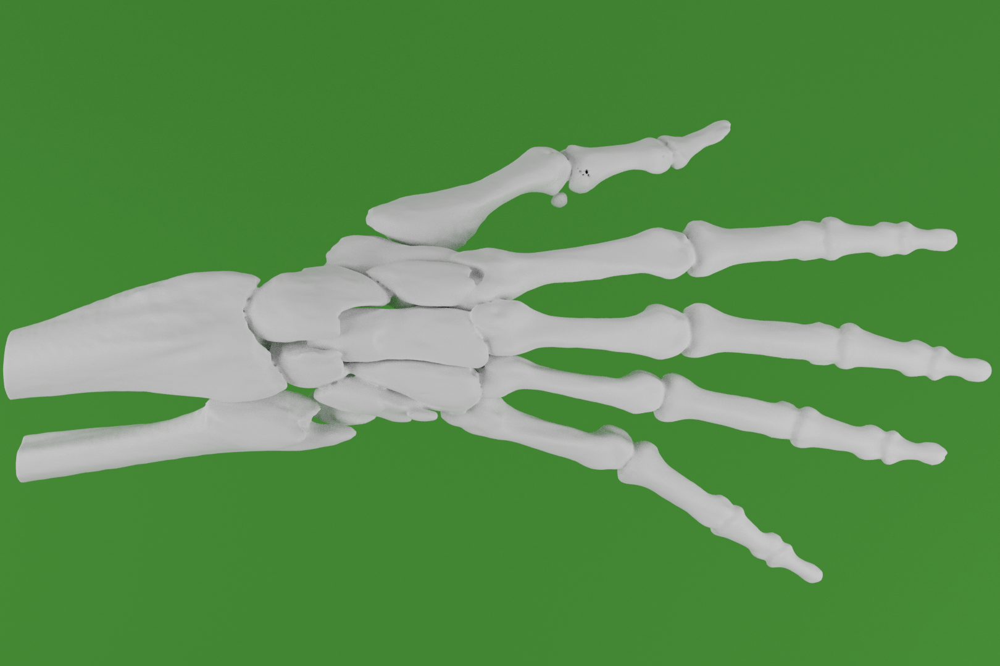

# AnatomyViewerAR
An android app for viewing and learning about anatomy using augmented reality.

The following pictures are able to be scanned, which renders the corresponding 3D model and allows the user to explore the anatomy of it in an interactive AR environment.
The user can also take an interactive quiz regarding the displayed model. 

Ideally, the pictures should be be printed in color on paper and placed on a flat surface. 
Alternatively, use a tablet or cell phone to display the picture. 

